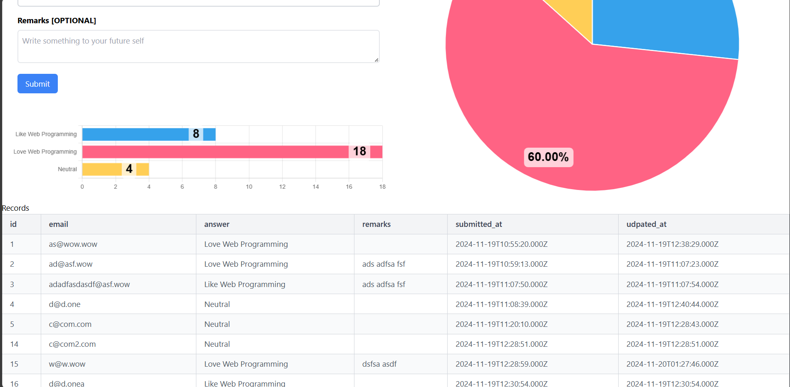

# Simple Survey form  
Simple Survey form with basic "graphical-visual aid"..., for a very simple statistical... analysis. 

## Table of Contents
- [Prerequisites](#prerequisites)
- [Setting Up XAMPP or LAMPP](#setting-up-xampp-or-lampp)
- [Backend Setup](#backend-setup)
  - [Database Configuration](#database-configuration)
  - [Dependencies Installation](#dependencies-installation)
  - [Starting the Backend](#starting-the-backend)
- [Frontend Setup](#frontend-setup)
  - [Dependencies Installation](#dependencies-installation)
  - [Running the Frontend](#running-the-frontend)
- [How to Use the Web App](#how-to-use-the-web-app)
- [Troubleshooting](#troubleshooting)
<!-- - [License](#license) -->

## Prerequisites
- **Node.js**: Ensure you have Node.js installed on your machine.
- **XAMPP/LAMPP**: For the MySQL database service.
- **Git**: For version control and cloning the repository.

## Setting Up XAMPP or LAMPP
1. Open XAMPP or LAMPP control panel.
2. Start the **MySQL** module service.
3. Verify that the database service is running:
   - Access **phpMyAdmin**.
   - Create or check the database as specified in the `backend/.env` file.

## Backend Setup

### Database Configuration
1. Navigate to the backend folder:
   ```bash
   cd backend
   ```
2. Open the .env file located in the backend directory.
3. Update the database credentials as per your MySQL setup:
    ```env
    LEARN_WEB_BACKEND_DB_HOST=localhost
    LEARN_WEB_BACKEND_DB_USERNAME=root
    LEARN_WEB_BACKEND_DB_PASSWORD=
    LEARN_WEB_BACKEND_DB_NAME=simple_survey_form_db
    LEARN_WEB_BACKEND_DB_PORT=3306
    LEARN_WEB_BACKEND_PORT=8008
    ```

### Dependencies Installation
* Run the following command to install required backend dependencies:
    ```bash
    npm install
    ```
* Note: This is required during the initial setup or when updating dependencies.

### Starting the Backend
* Start the backend server:
    ```bash
    npm start
    ```
* The backend server will listen on the port configured in the .env file (default: 8008 or as specified).


### Frontend Setup
Dependencies Installation
1. Navigate to the frontend folder
    ```bash
    cd frontend
    ```
2. Install the frontend dependencies
    ```bash
    npm install
    ```
    * Note: This is required during the initial setup or when updating dependencies.

### Running the Frontend
* Start the development server:
    ```bash
    npm run dev
    ```
* The frontend development server will start and should be accessible at http://localhost:3000 (or the configured port).

### How to Use the Web App 
(From the end user's perspective)
* The web app is intuitive and easy to use.

### Troubleshooting
* Database Connection Issues
    * Ensure the MySQL module is running.
    * Verify database credentials in backend/.env.

* Port Conflicts
    * Check if another service is using the same ports as the backend or frontend servers.
    * Update the port in backend/.env or frontend configuration (vite.config.js) if needed.

* Dependency Errors
    * Delete node_modules and re-run npm install.


## What it looks like
#### Home Page [Active]


#### Home Page [Inactive]


#### Home Page [Records]
